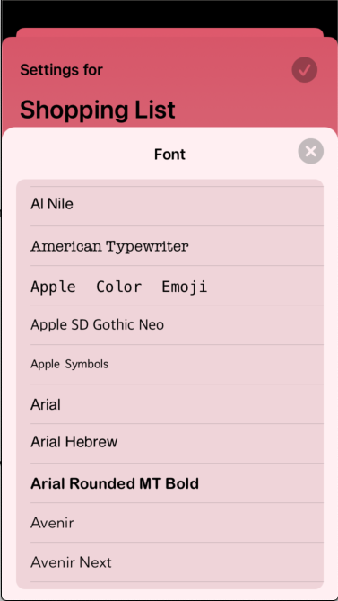

# HalfASheet

A sheet which you can use anywhere (eg, on another modal .sheet) with a few customisation options.



## Installation

### Swift Package Manager

In Xcode:
* File ⭢ Swift Packages ⭢ Add Package Dependency...
* Use the URL https://github.com/franklynw/HalfASheet


## Example

> **NB:** All examples require `import HalfASheet` at the top of the source file

It can be used directly as a view, which offers the full range of customisation options -

```swift
var body: some View {
    
    HalfASheet(isPresented: $isPresented, title: "Half a sheet") {
        // your view here
    }
    .backgroundColor(backgroundColor)
    .closeButtonColor(UIColor.gray.faded(0.4))
    .disableDragToDismiss
}
```

or as a modifier, which presents the default half-sheet, which is about 5/6 the height of the containing view -

```swift
var body: some View {

    MyView {
    
    }
    .halfASheet(isPresented: $isPresented, title: "Half a sheet") {
        // your view here
    }
}
```


### Set the height of the sheet as either a fixed height or as a proportion of the containing view's height

```swift
HalfASheet(isPresented: $isPresented, title: "Half a sheet") {
    // your view here
}
.height(.fixed(400))
```

or

```swift
HalfASheet(isPresented: $isPresented, title: "Half a sheet") {
    // your view here
}
.height(.proportional(0.6))
```

### Set the contentInsets of the view shown on the sheet

```swift
HalfASheet(isPresented: $isPresented, title: "Half a sheet") {
    // your view here
}
.contentInsets(EdgeInsets(top: 5, leading: 10, bottom: 5, trailing: 10))
```

### Set the background colour of the sheet

```swift
HalfASheet(isPresented: $isPresented, title: "Half a sheet") {
    // your view here
}
.backgroundColor(.red)
```

### Set the colour of the close button

```swift
HalfASheet(isPresented: $isPresented, title: "Half a sheet") {
    // your view here
}
.closeButtonColor(.green)
```

### Disable the default drag-down-to-dismiss behaviour

Normally, you can dismiss the sheet by dragging it downwards - this will disable that

```swift
HalfASheet(isPresented: $isPresented, title: "Half a sheet") {
    // your view here
}
.disableDragToDismiss
```

## Issues

Possibly not an issue, but the dimming background which is behind the HalfASheet only covers the containing view, rather than the whole screen. I aim to provide an option in the future which allows it to be full-screen

## License  

`HalfASheet` is available under the MIT license
